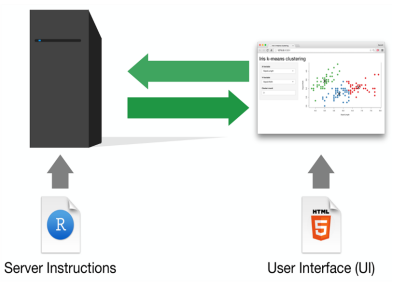
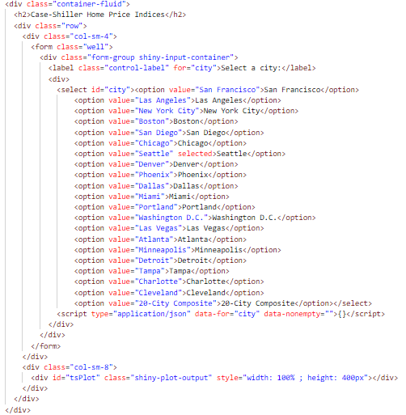
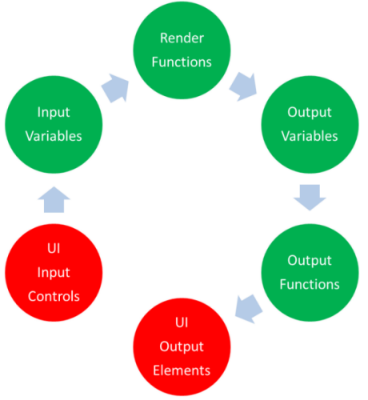
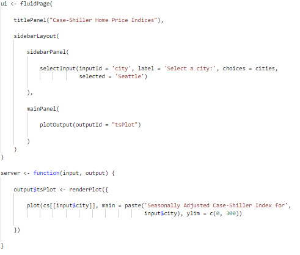
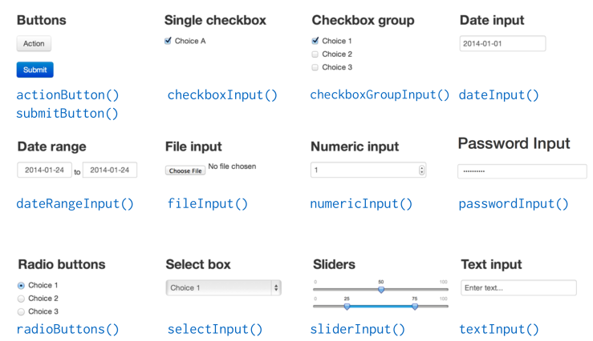
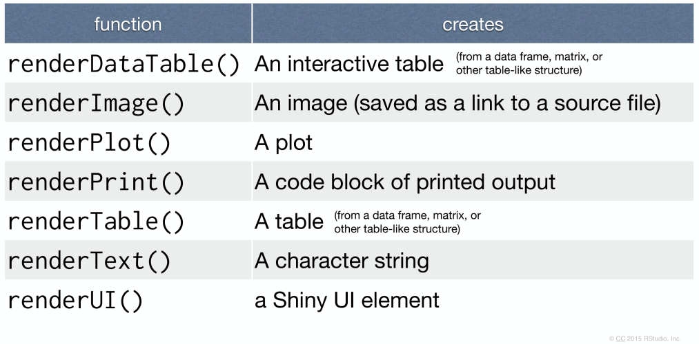
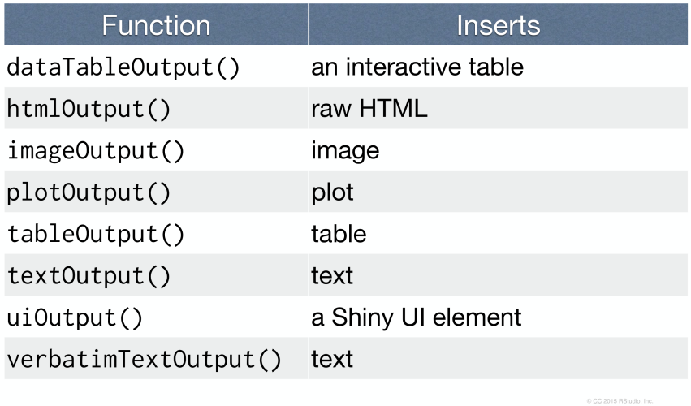
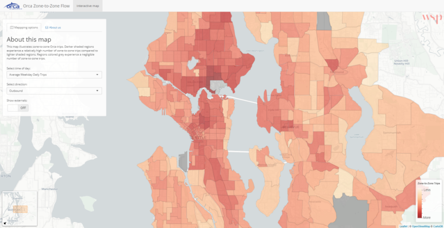
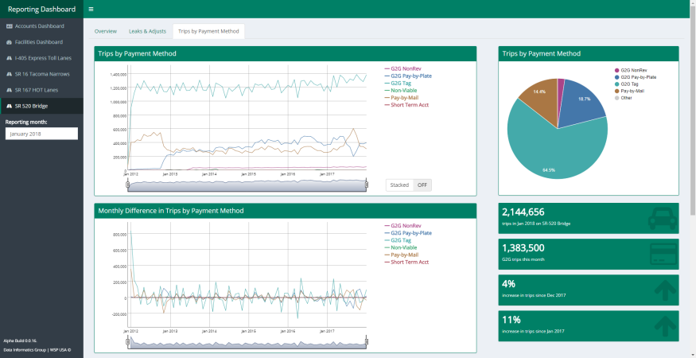

```{r setup, include=FALSE}
library(shiny)
knitr::opts_chunk$set(echo = FALSE)
logo <- 'images/r-ladies-transparent.png'
```

## About me {.smaller}
<!-- =========================================================================================== -->

* Lived in the Pacific Northwest for over 20 years
* Attended the University of Washington earning a B.A. in Geography
* Using R for about 7 years
* Data scientist working in the transportation sector
* I like to tell stories with data!


## About you {.flexbox .vcenter}
<!-- =========================================================================================== -->

`r icon::fa('question', size = 5)`

<!-- Who has heard of Shiny? -->
<!-- Who has used Shiny to visualize and present your R analyses? -->
<!-- Who has exposed Shiny applications usings RStudio's shinyapps.io? -->
<!-- Who has deployed Shiny applications to the cloud (AWS, Azure, GCP, DigitalOcean, Linode, etc.)? -->
<!-- Who has deployed Shiny applications to an on-premises server? -->
<!-- Who has heard of Docker? -->
<!-- Who has deployed Dockerized applications (Shiny or otherwise)? -->


# The basics
<!-- =========================================================================================== -->

## What is Shiny? {.smaller}
<!-- =========================================================================================== -->

<div class="columns-2">

**Shiny** by **RStudio** is a **web framework** for **R**:

* Shiny enables R developers to share their analyses and visualizations on the web

* Shiny consists of two main components:

    * The `shiny` **R package** - allows users to develop Shiny applications in R (no web development experience required, though it may come in handy)
    
    * **Shiny Server** - allows users to deploy Shiny applications on the web (some Linux systems administration required)

* Shiny is constantly evolving and has a very active open-source community

<center>


</center>

</div>


## Shiny application concepts {.smaller}
<!-- =========================================================================================== -->

<div class="columns-2">

* A shiny application consists of two parts:

    * the user interface or UI (HTML/CSS)
    
    * the server logic (R/JavaScript)

* Shiny implements a reactive programming paradigm:

    1. Observing **input** from the user
    2. Performing **computations** based on these inputs
    3. Displaying **outputs** based on these computations
    
<br>

<center>



</center>

</div>


# A simple Shiny app
<!-- =========================================================================================== -->

## {.smaller}
<!-- =========================================================================================== -->

```{r, echo = FALSE}
library(quantmod, quietly = TRUE)
load('cs/cs.Rdata')

ui <- fluidPage(
    
    titlePanel("Case-Shiller Home Price Indices"),
    
    sidebarLayout(
        
        sidebarPanel(
            
            selectInput(inputId = 'city', label = 'Select a city:', choices = cities,
                        selected = 'Seattle')
            
        ),
        
        mainPanel(
            
            plotOutput(outputId = "tsPlot")
            
        )
    )
)

server <- function(input, output) {
    
    output$tsPlot <- renderPlot({
        
        plot(cs[[input$city]], main = paste('Seasonally Adjusted Case-Shiller Index for',
                                            input$city), ylim = c(0, 300))
        
    })
    
}

shinyApp(ui = ui, server = server)
```


## The UI {.smaller}
<!-- =========================================================================================== -->

```{r, echo = TRUE, eval = FALSE}
ui <- fluidPage(
    
    titlePanel("Case-Shiller Home Price Indices"),
    
    sidebarLayout(
        
        sidebarPanel(
            
            selectInput(inputId = 'city', label = 'Select a city:', choices = cities,
                        selected = 'Seattle')
            
        ),
        
        mainPanel(
            
            plotOutput(outputId = "tsPlot")
            
        )
    )
)
```


## The UI {.smaller .flexbox .vcenter}
<!-- =========================================================================================== -->




## The server {.smaller}
<!-- =========================================================================================== -->

```{r, echo = TRUE, eval = FALSE}
server <- function(input, output) {
    
    output$tsPlot <- renderPlot({
        
        plot(cs[[input$city]], main = paste('Seasonally Adjusted Case-Shiller Index for',
                                            input$city), ylim = c(0, 300))
        
    })
    
}

shinyApp(ui = ui, server = server)
```


# More on reactivity
<!-- =========================================================================================== -->

## General reactive workflow for Shiny applications {.smaller .flexbox .vcenter}
<!-- =========================================================================================== -->

<div class="columns-2">





</div>


## Input elements {.smaller .flexbox .vcenter}
<!-- =========================================================================================== -->




## Render functions {.smaller .flexbox .vcenter}
<!-- =========================================================================================== -->




## Output functions {.smaller .flexbox .vcenter}
<!-- =========================================================================================== -->




# More advanced applications
<!-- =========================================================================================== -->

## Shiny + leaflet {.smaller .flexbox .vcenter}
<!-- =========================================================================================== -->



https://byollin.shinyapps.io/orca/


## Shiny + shinydashboard {.smaller .flexbox .vcenter}
<!-- =========================================================================================== -->



http://127.0.0.1:3838/reporting/


# Wrap up
<!-- =========================================================================================== -->

## Add-on packages for Shiny {.smaller}
<!-- =========================================================================================== -->

* `shinyjs` - extends the Shiny package and provides utilities for calling custom JavaScript bindings
* `shinythemes` - adds Bootswatch CSS themes to Shiny applications
* `shinydashboard` - wraps the Admin LTE library for creating dashboard interfaces
* `leaflet` - wraps the leaflet JavaScript library for interactive, mobile-friendly web-mapping
* `DT` - interactive tables
* `dygraphs` - interactive time-series charts
* `googleVis` - interface to the Google Charts API
* `crosstalk` - enables cross-widget interaction
* `plumbr` - create web APIs that call R
* `promises` - enables asynchronous evaluation R code
* Much more! Explore some here: http://gallery.htmlwidgets.org/


## Resources for getting started with Shiny {.smaller}
<!-- =========================================================================================== -->

* https://shiny.rstudio.com/tutorial/

* https://shiny.rstudio.com/articles/

* https://shiny.rstudio.com/gallery/


# Questions?
<!-- =========================================================================================== -->
